# MyKart — Visual Interface & Portfolio Screenshot Guide

This directory holds visual UI screenshot references and walkthrough documentation for **MyKart**, captured directly from the live production deployment ([https://mykart-ecommerce-web.vercel.app](https://mykart-ecommerce-web.vercel.app)).

---

## 🖼️ Top 11 Core Application Screenshot Views

### 1. Homepage & Hero Discovery
Prominent banner carousel showcasing active discount deals, top brands, and curated category grids.

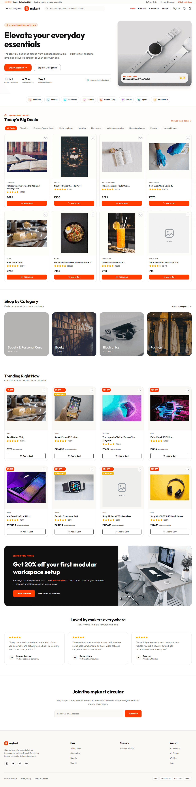

---

### 2. Product Search & Faceted Filter Controls
Faceted filter sidebar featuring dual-range price & discount sliders, brand selector with instant search, rating filters, and category tree navigation.

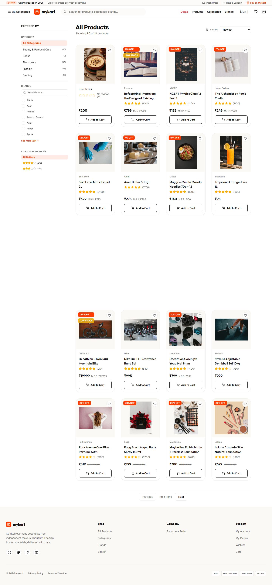

---

### 3. Live Search Autocomplete Suggestions
Instant search autocomplete dropdown with product thumbnails, pricing, and category suggestions powered by Meilisearch.

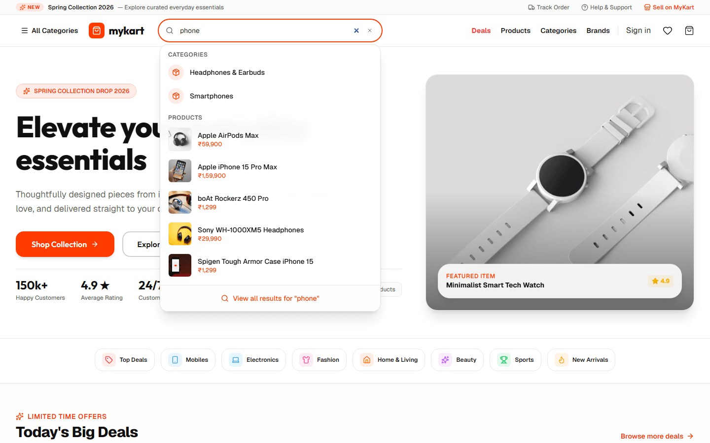

---

### 4. Product Detail Page (PDP)
High-resolution image presentation, variant selectors (Color/Size), stock availability badges, pricing details, and customer reviews.

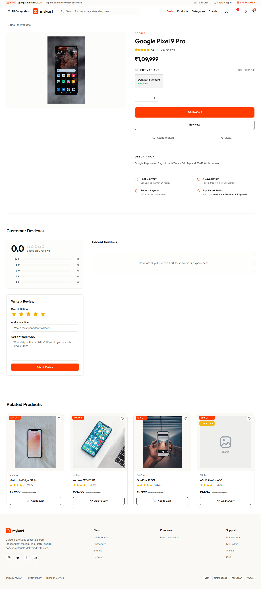

---

### 5. Itemized Cart Manager
Dynamic quantity controls, real-time price calculations, coupon redemption input, and checkout redirect.

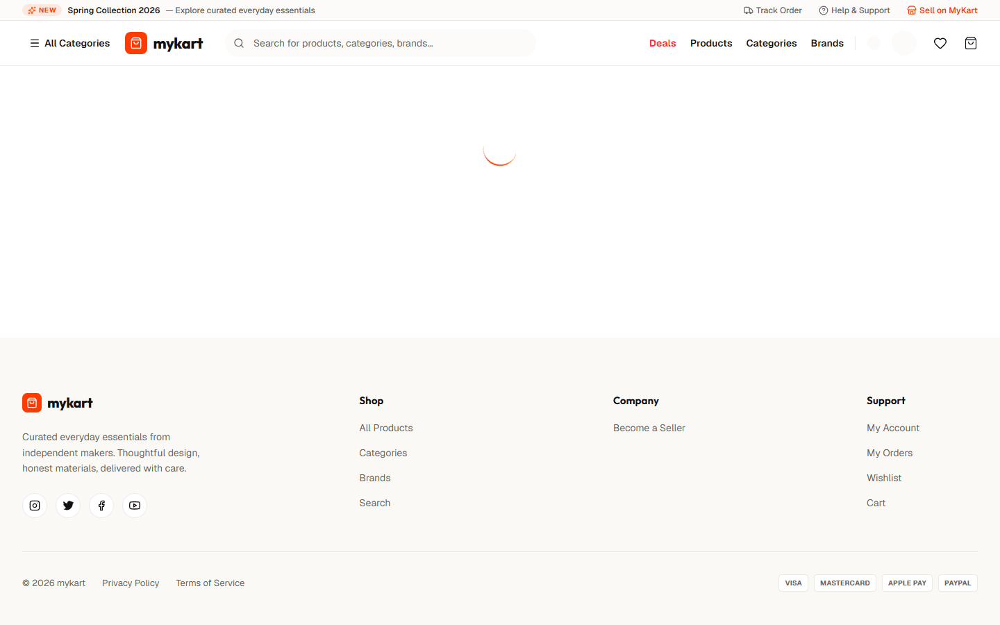

---

### 6. Multi-Step Checkout Experience
Saved delivery address selection, order item summary with GST tax breakdown, and payment selection UI (COD, UPI, Credit Card, Netbanking, Wallets).

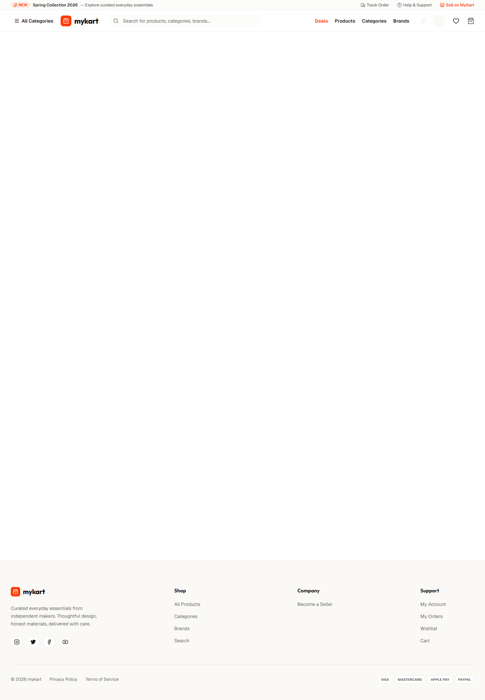

---

### 7. Customer Account Suite (`/account`)
Customer dashboard displaying order statistics, recent order history timelines (`PENDING` → `PROCESSING` → `SHIPPED` → `DELIVERED`), saved delivery address book, wishlist, and notification alerts.

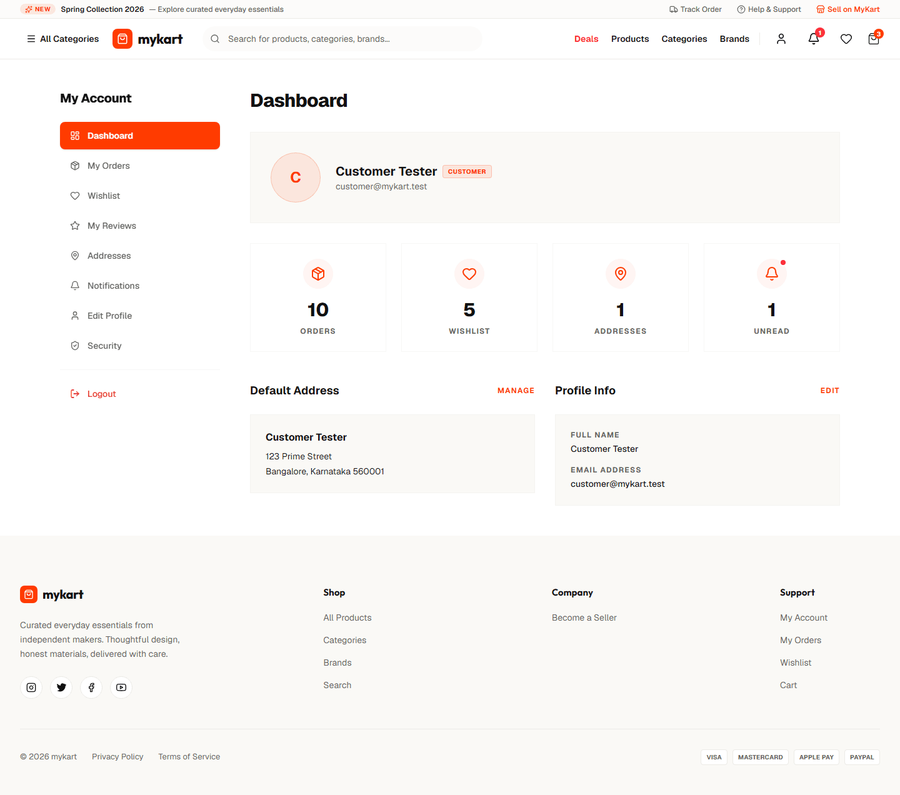

---

### 8. Seller Center (`/seller`)
Seller management dashboard featuring store revenue metrics, sales volume, active product inventory, low-stock threshold alerts, and customer order fulfillment controls.

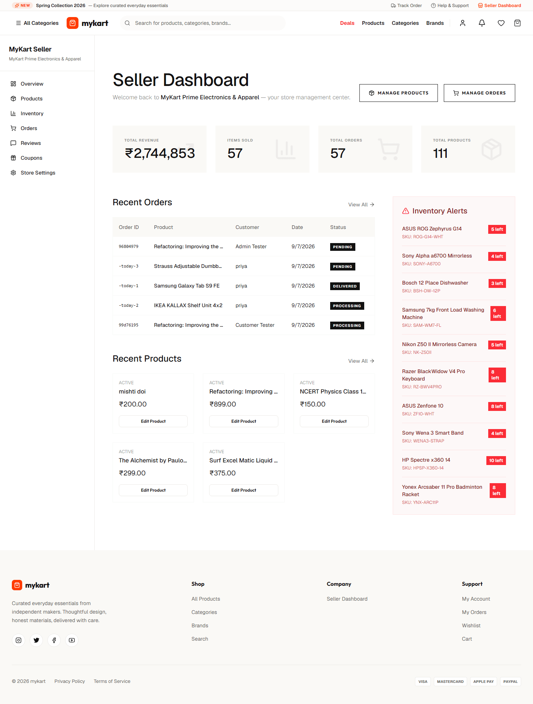

---

### 9. Admin Control Panel (`/admin`)
Executive governance portal showing live marketplace GMV statistics, active platform coupon statistics, order status distribution, and quick management controls.

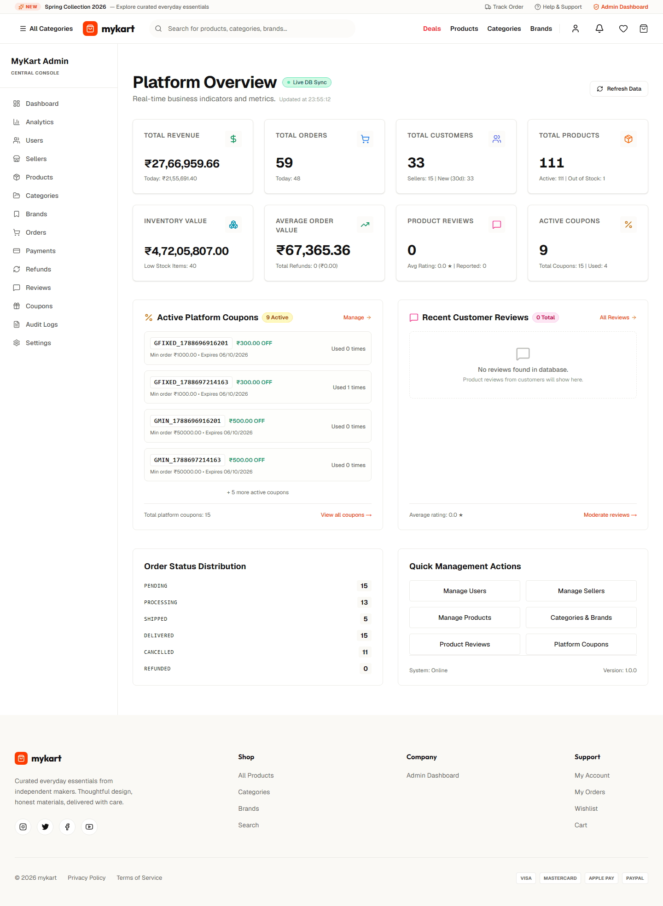

---

### 10. Executive Analytics & Commerce Intelligence (`/admin/analytics`)
Comprehensive business intelligence dashboard rendering Net Charged Revenue, Gross Merchandise Sales (GMS), Units Sold, AOV, Daily Order Activity trends, Category Revenue Breakdown, Top Brands, and Top Performing Products.

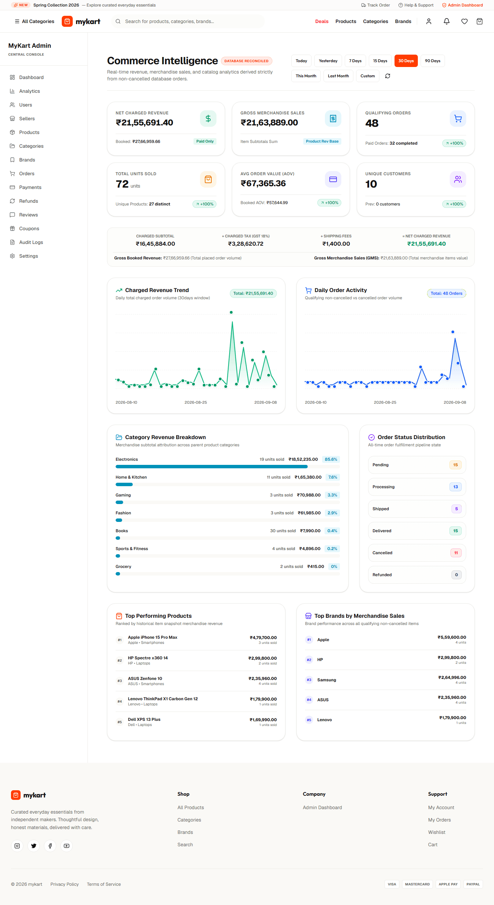

---

### 11. Mobile Responsive Usability
Verified responsive layout rendering across mobile viewports (390x844) with zero horizontal overflow and optimized touch interactions.

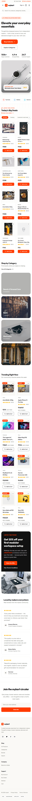

---

*Note: All views are verified against the production deployment (`https://mykart-ecommerce-web.vercel.app`) with 0 console errors, 0 broken images, and 0 layout overflows.*

